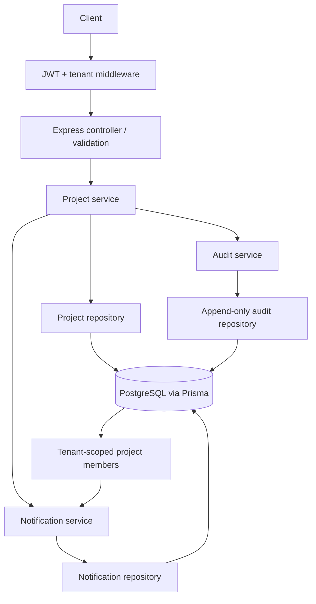

# Architecture and Flow Diagram

```mermaid
flowchart TD
  Client --> Auth[JWT + tenant middleware]
  Auth --> Route[Express controller / validation]
  Route --> ProjectService[Project service]
  ProjectService --> ProjectRepo[Project repository]
  ProjectRepo --> Prisma[(PostgreSQL via Prisma)]
  ProjectService --> AuditService[Audit service]
  ProjectService --> NotificationService[Notification service]
  AuditService --> AuditRepo[Append-only audit repository]
  NotificationService --> NotificationRepo[Notification repository]
  AuditRepo --> Prisma
  NotificationRepo --> Prisma
  Prisma --> Members[Tenant-scoped project members]
  Members --> NotificationService
```
